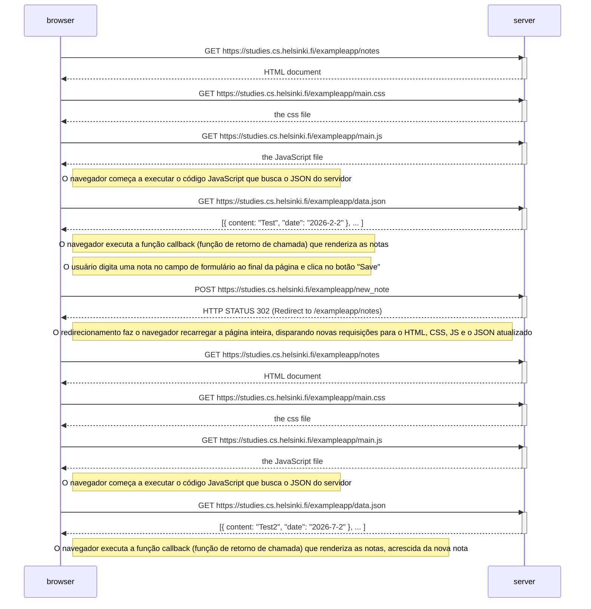

```mermaid
sequenceDiagram
participant browser
participant server

    browser->>server: GET https://studies.cs.helsinki.fi/exampleapp/notes
    activate server
    server-->>browser: HTML document
    deactivate server

    browser->>server: GET https://studies.cs.helsinki.fi/exampleapp/main.css
    activate server
    server-->>browser: the css file
    deactivate server

    browser->>server: GET https://studies.cs.helsinki.fi/exampleapp/main.js
    activate server
    server-->>browser: the JavaScript file
    deactivate server

    Note right of browser: O navegador começa a executar o código JavaScript que busca o JSON do servidor

    browser->>server: GET https://studies.cs.helsinki.fi/exampleapp/data.json
    activate server
    server-->>browser: [{ content: "Test", "date": "2026-2-2" }, ... ]
    deactivate server

    Note right of browser: O navegador executa a função callback (função de retorno de chamada) que renderiza as notas

    Note right of browser: O usuário digita uma nota no campo de formulário ao final da página e clica no botão "Save"

    browser->>server: POST https://studies.cs.helsinki.fi/exampleapp/new_note
    activate server
    server-->>browser: HTTP STATUS 302 (Redirect to /exampleapp/notes)
    deactivate server

    Note right of browser: O redirecionamento faz o navegador recarregar a página inteira, disparando novas requisições para o HTML, CSS, JS e o JSON atualizado

    browser->>server: GET https://studies.cs.helsinki.fi/exampleapp/notes
    activate server
    server-->>browser: HTML document
    deactivate server

    browser->>server: GET https://studies.cs.helsinki.fi/exampleapp/main.css
    activate server
    server-->>browser: the css file
    deactivate server

    browser->>server: GET https://studies.cs.helsinki.fi/exampleapp/main.js
    activate server
    server-->>browser: the JavaScript file
    deactivate server

    Note right of browser: O navegador começa a executar o código JavaScript que busca o JSON do servidor

    browser->>server: GET https://studies.cs.helsinki.fi/exampleapp/data.json
    activate server
    server-->>browser: [{ content: "Test2", "date": "2026-7-2" }, ... ]
    deactivate server

    Note right of browser: O navegador executa a função callback (função de retorno de chamada) que renderiza as notas, acrescida da nova nota
```
