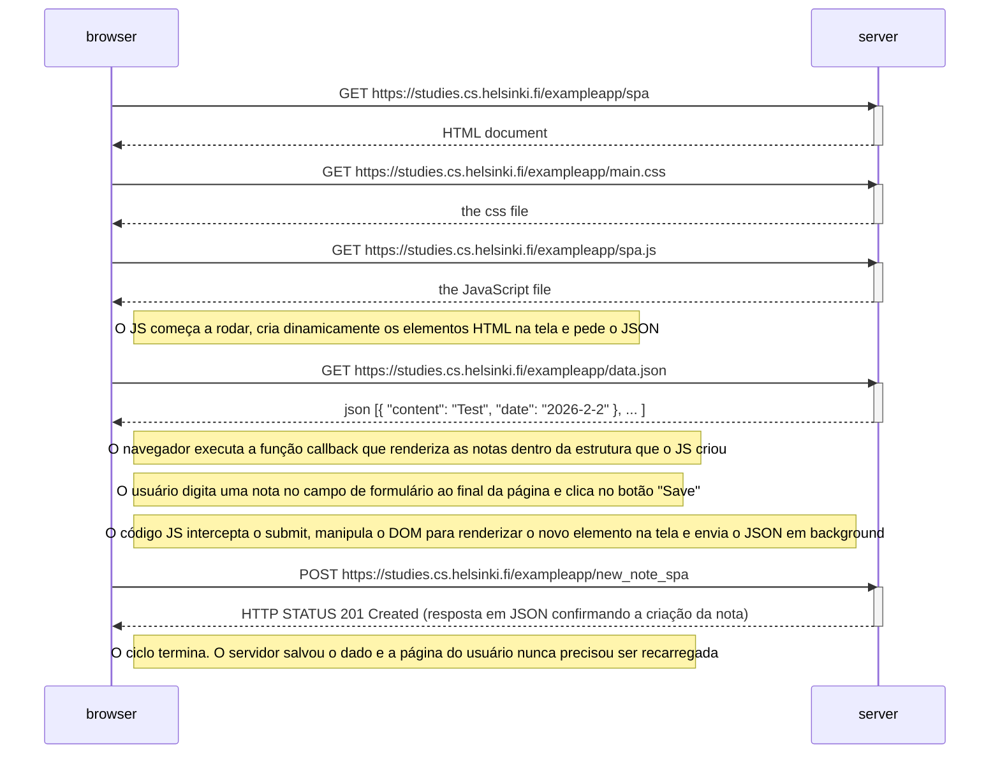

```mermaid
sequenceDiagram
participant browser
participant server

    browser->>server: GET https://studies.cs.helsinki.fi/exampleapp/spa
    activate server
    server-->>browser: HTML document
    deactivate server

    browser->>server: GET https://studies.cs.helsinki.fi/exampleapp/main.css
    activate server
    server-->>browser: the css file
    deactivate server

    browser->>server: GET https://studies.cs.helsinki.fi/exampleapp/spa.js
    activate server
    server-->>browser: the JavaScript file
    deactivate server

    Note right of browser: O JS começa a rodar, cria dinamicamente os elementos HTML na tela e pede o JSON

    browser->>server: GET https://studies.cs.helsinki.fi/exampleapp/data.json
    activate server
    server-->>browser: json [{ "content": "Test", "date": "2026-2-2" }, ... ]
    deactivate server

    Note right of browser: O navegador executa a função callback que renderiza as notas dentro da estrutura que o JS criou

    Note right of browser: O usuário digita uma nota no campo de formulário ao final da página e clica no botão "Save"

    Note right of browser: O código JS intercepta o submit, manipula o DOM para renderizar o novo elemento na tela e envia o JSON em background

    browser->>server: POST https://studies.cs.helsinki.fi/exampleapp/new_note_spa
    activate server
    server-->>browser: HTTP STATUS 201 Created (resposta em JSON confirmando a criação da nota)
    deactivate server

    Note right of browser: O ciclo termina. O servidor salvou o dado e a página do usuário nunca precisou ser recarregada

```
